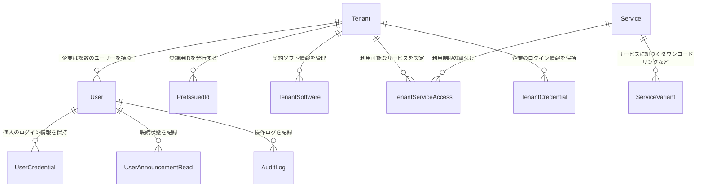

# DLCare-Portal 技術詳細・開発者ガイド (Technical Handover & Developer Guide)

本ドキュメントは、社外の開発会社（外注先）が本システムの「開発」「運用」「保守」をスムーズに引き継げるように作成された技術ガイドです。
専門的なコード構造だけでなく、「システムがどう動いているか」「開発時に何に注意すべきか」を分かりやすく解説しています。

---

## 1. はじめに（システムの全体像）

本システム「DLCare-Portal」は、顧客企業（テナント）ごとに専用のマイページやダッシュボードを提供し、契約しているソフトウェアのダウンロードや外部サービスへのシームレスなアクセスを実現するプラットフォームです。

### 1.1 使用している技術 (技術スタック)
- **画面・機能 (フレームワーク)**: Next.js 16 (React 19) / TypeScript
- **データベース接続 (ORM)**: Prisma ORM
- **データベース**: SQLite (開発環境: `prisma/dev.db`) / PostgreSQL (本番環境)
- **ユーザー認証 (ログイン管理)**: NextAuth.js v5 (auth.js)
- **デザイン・装飾 (CSS)**: Tailwind CSS (v4) / Vanilla CSS
- **アイコン・UI部品**: `lucide-react` (アイコン), `shadcn/ui` (ボタンや入力フォームなどの共通部品)

### 1.2 3つの「ユーザー権限（ロール）」
ユーザーの役割に応じて、利用できる機能を厳密に制限しています。
1. **`SYSTEM_ADMIN` (システム管理者)**
   - **できること**: すべての顧客企業（テナント）の登録・削除、全ユーザーの管理、お知らせの作成、連携する外部サービスの登録など、システム全般のマスターデータ管理。
2. **`TENANT_ADMIN` (テナント管理者)**
   - **できること**: 自社に所属する一般ユーザーのアカウント発行（事前発行IDの作成）、自社メンバーの利用状況確認。
3. **`GENERAL_USER` (一般ユーザー)**
   - **できること**: ダッシュボードからの各種サービス利用、マイページでの自分のプロフィール（住所やパスワード等）の編集、お知らせの閲覧。

---

## 2. 【最優先】開発環境の立ち上げ手順

外注先でローカル開発を始めるための手順です。

### STEP 1: 環境変数の設定
プロジェクトのルート（一番上のフォルダ）にある `.env.example` をコピーして、新しく `.env` という名前のファイルを作成します。
```bash
cp .env.example .env
```
※作成した `.env` ファイル内の `NEXTAUTH_SECRET` には、セッションを暗号化するための任意のランダムな文字列（英数字）を設定してください。

### STEP 2: 必要なパッケージのインストール
```bash
npm install
```

### STEP 3: データベースのセットアップ（テーブル作成と初期データ投入）
データベースのテーブルを作成し、開発テストに必要な初期データ（管理者アカウントやデモ企業データ）を登録します。
```bash
# 1. データベースのテーブルを作成・更新する
npx prisma migrate dev --name init

# 2. 初期データをデータベースに登録する (シード処理)
npx prisma db seed
```
> [!NOTE]
> 初期データ（シード）が実行されると、システム管理者ログイン用のテストアカウント等が自動的に作成されます。

### STEP 4: 開発サーバーの起動
```bash
npm run dev
```
起動後、ブラウザで [http://localhost:3000](http://localhost:3000) にアクセスするとログイン画面が表示されます。

---

## 3. プロジェクトのフォルダ構成（どこに何があるか）

開発時に編集する主なフォルダとファイルの位置です。

- **`prisma/`**: データベースの設計図（[schema.prisma](file:///d:/%E3%82%BD%E3%83%95%E3%83%88%E9%96%8B%E7%99%BA/DLCare-Portal/prisma/schema.prisma)）や、初期データを投入するプログラム（`seed.ts`）が入っています。
- **`src/app/`**: 画面（ページ）やWeb APIが配置されています（App Router形式）。
  - **`login/`**: ログイン画面。
  - **`register/`**: ユーザー登録画面（企業情報を自動で判別するロジックも含みます）。
  - **`dashboard/`**: ログイン後に表示される全画面。
    - **`admin/`**: システム管理者だけが使えるマスター管理画面。登録処理（[actions.ts](file:///d:/%E3%82%BD%E3%83%95%E3%83%88%E9%96%8B%E7%99%BA/DLCare-Portal/src/app/dashboard/admin/actions.ts)）もここに集約されています。
    - **`tenant-users/`**: テナント管理者（顧客企業の代表）が自社ユーザーを管理する画面。
- **`src/middleware.ts`**: ログインしていないユーザーや、権限のないユーザーが不正にページを開くのを防ぐ（リダイレクトする）セキュリティフィルターです。
- **`src/components/`**: ボタンやサイドバー、上部メニューリボンなど、画面を構成する共通パーツが入っています。

---

## 4. データベースのデータ構造 (データモデル)

データ同士のつながりを整理した図（ER図）です。



- **`Tenant` (テナント)**: 顧客企業の情報（会社名、住所、電話番号、保守IDなど）。
- **`User` (ユーザー)**: 個人アカウント情報。必ずどこか1つの `Tenant` に所属します。
- **`Service` (サービス)**: ダッシュボードにアイコン表示される外部ツール（チャットやセミナー動画等）。
- **`TenantServiceAccess`**: どの企業が、どのサービスを利用できるかを制御する中間テーブル。

---

## 5. 主要な機能の動く仕組み（ロジック）

### 5.1 企業情報の自動特定・登録ロジック (`src/app/register/`)
ユーザーがアカウントを自己登録する際、管理者が事前に登録した企業データ（`Tenant`）と自動的に紐付けるための照合エンジンです。

**照合処理の優先順位:**
1. **保守ID (DLCare ID)** での完全一致検索。
2. **企業名** での照合（「株式会社」や「（株）」、前株・後株などの表記揺れをシステムで取り除いて比較します）。
3. **住所** での照合（都道府県名やビル名などを正規化し、前方一致するかどうかで判定します）。
4. **メールアドレスのドメイン** での照合（gmail等のフリーメールを除外した企業専用ドメインで判定します）。

### 5.2 サーバー側でのデータ処理 (Server Actions)
データの登録・変更・削除は、APIを使わずにサーバー側で直接関数を実行する「Server Actions」を採用しています。
- **必ず二重で権限チェックを行う**:  
  URLの直叩き等による不正操作を防ぐため、各関数（[actions.ts](file:///d:/%E3%82%BD%E3%83%95%E3%83%88%E9%96%8B%E7%99%BA/DLCare-Portal/src/app/dashboard/admin/actions.ts)内など）の開始時に、**「本当にその操作を行う権限があるユーザーか」**をセッションから再確認する処理を必ず実装しています。
- **一括処理（トランザクション）**:  
  「企業の登録」と「その企業用の初期設定の登録」のように、複数のデータ作成が同時に行われる場合、途中でエラーが起きたらすべて巻き戻す（ロールバックする）ために Prisma の `$transaction` を徹底しています。

---

## 6. 開発時の重要なルール（開発者に守ってもらうこと）

外注先がコードを変更・追加する際に、必ず守るべきルールです。

### 6.1 安全なデータ削除（誤削除の防止）
- **確認ダイアログの表示**: データの削除を実行するボタンでは、ブラウザの `confirm()` ダイアログを必ず表示し、二段階で確認させてください。
- **システム管理用アカウントの保護**:  
  「株式会社データロジック (システム管理)」のようなシステム運用に必須のアカウントや企業データは、削除処理のプログラム内部でIDや名前をチェックし、**絶対に削除できないように例外エラーを発生させる保護コード**を入れてください。

### 6.2 表示パフォーマンスの維持
- **アイコンの個別インポート制限**:  
  `lucide-react` のアイコンをプログラム内で動的に一括読み込みすると、ページの読み込み速度が著しく低下します。使用するアイコンは `IconMap` などのマッピングオブジェクトを用意して、静的にインポートする設計を厳守してください。
- **データ取得の並列処理**:  
  ログイン後の画面などで「ユーザー情報」「お知らせの未読数」「メーター情報」などを個別に待つのではなく、`Promise.all` を使用して同時に並列でデータベースから取得し、画面描画を高速化してください。
