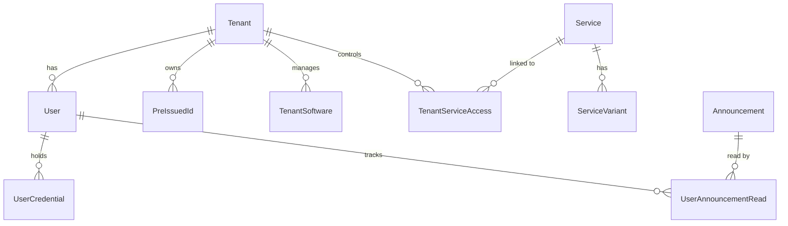

# DLCare-Portal システム開発仕様書（見積依頼用）

## 1. プロジェクト概要
本プロジェクトは、製造業向けソフトウェア「DLCare」等のユーザーに対し、各ソフトウェアのライセンス管理やサポートサービスへのシームレスなアクセスを提供する「カスタマーポータルサイト」の開発・拡張を目的としています。

### 1.1 背景と目的
- 散在している複数の外部サービス（AIチャット、セミナー動画、ライセンス交換等）を1つのポータルに集約する。
- マルチテナント方式により、企業（テナント）ごとの利用状況や権限管理を効率化する。
- ユーザー自身がアカウントを作成できる「発行ID方式」を採用し、管理側の運用負荷を軽減する。
- **管理者事前登録・自動照合方式**を採用し、管理者が登録した企業データとユーザー入力を照合することで、セキュリティと利便性を両立する。

## 2. システム画面イメージ（参考）
> [!NOTE]
> 開発中のプロトタイプ画面です。外注時にはこれらUIのブラッシュアップと機能の完全実装を求めます。

- **ログイン画面**: 
- **サービス利用申請フォーム**: 
- **管理者ダッシュボード**: 
- **ユーザーダッシュボード**: 
- **サービス連携（iframe）表示**: 

## 3. システム構成（技術スタック）
既存のプロトタイプ資産を活用するため、以下の技術スタックを原則とします。

- **Frontend/Backend**: Next.js 15+ (App Router), TypeScript
- **Database**: PostgreSQL (Neon.tech を推奨)
- **ORM**: Prisma
- **Auth**: NextAuth.js (Auth.js v5)
- **Styling**: Tailwind CSS, Shadcn UI
- **Infrastructure**: Vercel (Hosting)

## 4. 主要機能要件

### 4.1 権限・認証管理
<!-- スクリーンショット: file:///C:/Users/N_Sawae/.gemini/antigravity/brain/adcc1819-55e4-419e-b657-74bb22d37683/registration_step1_1778653439887.png -->
- **認証方式**: メールアドレス/パスワード認証。
- **3段階の権限モデル**:
  1. **システム管理者 (SYSTEM_ADMIN)**: 全テナント・ユーザー・サービスマスタの管理。
  2. **テナント管理者 (TENANT_ADMIN)**: 自テナント内のユーザー作成（上限数内）、権限変更、ステータス管理。
  3. **一般ユーザー (GENERAL_USER)**: サービス利用、プロフィール管理。
- **高度な会社情報照合登録**:
  - ユーザーが入力した DLCare ID、会社名、住所、電話番号、メールアドレスを基に既存テナントを自動特定。
  - **優先順位: 1. DLCare ID（保守ID） 2. 会社名（完全一致） 3. 住所（前方一致） 4. メールドメイン**
  - 法人格（㈱、株式会社、前株・後株等）の表記揺れを吸収・区別する正規化エンジン。
- **付帯サービス同時申請（必須）**:
  - アカウント作成時に「ECサイト」「く～chat」「オンラインセミナー」の利用申請情報をすべて入力。
  - 申請内容は管理者が「連携詳細パネル」で確認・編集可能。

### 4.2 テナント管理（システム管理者向け）
<!-- スクリーンショット: file:///C:/Users/N_Sawae/.gemini/antigravity/brain/adcc1819-55e4-419e-b657-74bb22d37683/admin_dashboard_1778653561013.png -->
- テナントの新規作成・編集・削除（論理削除推奨）。
- ユーザー上限数の設定。
- テナントごとの利用可能ソフトウェア（ライセンス）の登録・管理。
- テナントごとのサービス表示/非表示制御。

### 3.3 サービス連携・リボンUI
- **ダッシュボード**: アイコンベースの「サービスリボン」による外部サイトへのリンク提供。
- **iframe埋め込み**: 特定のサービス（AIチャット等）をポータル内で直接操作可能にする。
- **クレデンシャル管理**: 外部サービスのログインID/パスワードを管理し、コピー＆ペーストを補助する機能。
- **UI操作**: リボンの折りたたみ機能、iframe領域の最大化。

### 3.4 お知らせ配信機能
- ターゲット配信（全体 / ロール指定 / テナント指定）。
- お知らせ種別（INFO, ALERT, SYSTEM等）の設定。
- ユーザーごとの既読管理機能。

### 3.5 マイページ
- プロフィール編集（氏名、電話番号、部署等）。
- アバター画像アップロード。
- パスワード変更機能。

## 4. データモデル概要
主要なエンティティ間の関係性は以下の通りです。

## 5. UI/UX 要件
- **デザインコンセプト**: SaaSライクなモダンでプレミアムな質感。
- **ダークモード/ライトモード**: 現在はライトモードをベースとしつつ、洗練された配色（Indigo, Slate等）を使用。
- **レスポンシブ**: PC, タブレット, スマートフォンの各デバイスへの最適化。
- **インタラクション**: ローディング状態（Skeleton Screen）、トースト通知、スムーズな開閉アニメーション。

## 6. 非機能要件
- **セキュリティ**: パスワードのハッシュ化、CSRF対策、ロールベースのアクセス制御（RBAC）の徹底。
- **パフォーマンス**: Next.jsのServer Componentsを積極的に利用した高速な初期描画。
- **保守性**: ESLint, Prettierによるコード品質管理、主要ロジックへのコメント付与。

## 7. 納品・検証要件
- ソースコード一式（GitHubリポジトリ経由）。
- データベースマイグレーションファイル。
- 動作検証（Vercel等の本番環境での正常動作確認）。
- 管理者向けマニュアル（簡易版）。
